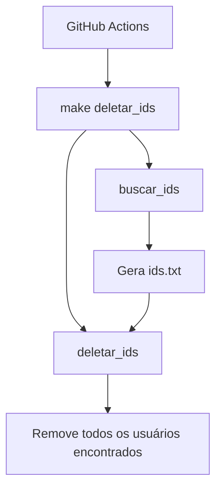

# cleanup-serverest

Automação responsável por remover usuários criados durante a execução dos testes automatizados do **Hora do QA** no **ServeRest**.

O projeto utiliza um **Makefile** para buscar os IDs dos usuários de teste e removê-los automaticamente por meio de um workflow do **GitHub Actions**, executado diariamente.

## Objetivo

Durante a execução dos testes automatizados são criados usuários para validação dos cenários. Com o passar do tempo, esses registros se acumulam no ambiente do ServeRest.

Este projeto executa uma rotina de limpeza que:

1. Busca todos os usuários de teste.
2. Salva seus IDs em um arquivo temporário (`ids.txt`).
3. Remove todos os usuários encontrados utilizando a API do ServeRest.

## Fluxo da execução



## Estrutura do projeto

```
.
├── .github/
│   └── workflows/
│       └── cleanup.yml
├── Makefile
└── README.md
```

## Targets disponíveis

### `buscar_ids`

Consulta a API do ServeRest, localiza os usuários de teste e salva seus IDs no arquivo `ids.txt`.

```bash
make buscar_ids
```

### `deletar_ids`

Executa a rotina completa de limpeza.

Como esse target depende de `buscar_ids`, o Make executa automaticamente a busca dos IDs antes da remoção dos usuários.

```bash
make deletar_ids
```

## Automação

A limpeza é realizada automaticamente através do **GitHub Actions**, executado diariamente no horário configurado no workflow.

Também é possível executar a rotina manualmente pela opção **Run workflow** na aba **Actions** do repositório.

## Requisitos

* GNU Make
* curl
* jq

## Licença

Este projeto é destinado ao apoio dos conteúdos e demonstrações do **Hora do QA**.
